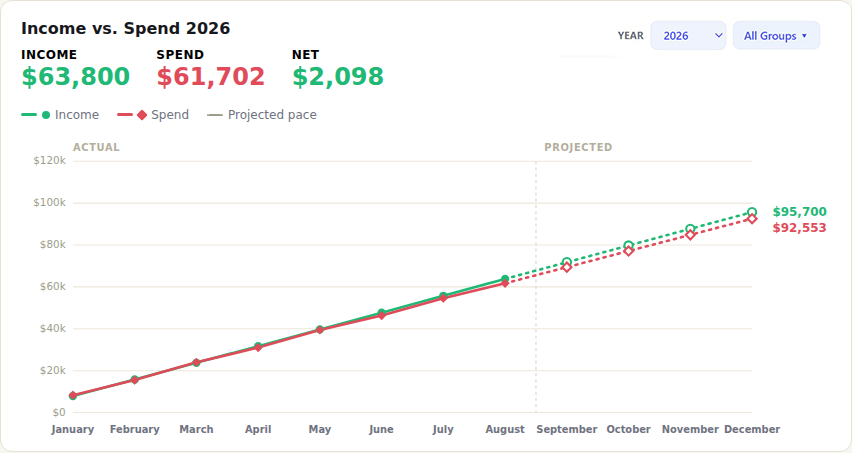
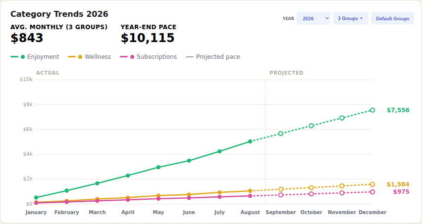

# YNAB Cumulative Trends

## Problem

Zero-based budgeting accounts for every dollar, but that means investments and savings often flow into a "spend" category too, obscuring your real savings rate. Without cumulative trends, it's hard to see how spending in a category builds over the year until it's already a problem.

## Solution

I wrote a Tampermonkey userscript that adds cumulative **Income vs. Spend** and **Category Trends** above YNAB's native monthly bar chart. These visuals show how income and spending trends build through the year, making trends easier to identify. The category selector lets you exclude savings and investment categories from the Spend total, so they don't mask your real spending patterns. The category trend was motivated by my desire to watch lifestyle creep in key categories, such as spending on eating out and personal services.

> The illustrations below use fabricated sample data 

## Screenshots

<table>
<tr>
<td width="50%">

**Income vs. Spend**

</td>
<td width="50%">

**Category Trends**

</td>
<td width="50%"></td>
</tr>
</table>

## Features

- **Cumulative, not monthly.** Both charts run a year-to-date total rather than resetting each month, so trend direction and category creep are obvious at a glance.
- **Category picker.** A dropdown styled after YNAB's own "All Categories" selector lets you choose exactly which categories count toward Spend, and which category groups get their own line on Category Trends — each with its own color, search box, and Select All/None.
- **Saved default groups.** Each budget can remember your preferred default Category Trends groups. Use the new button in the chart header to choose defaults, save them per budget, or reset them to none.
- **Year selector.** Switch between any year present in your budget. The current year projects the remaining months at your actual average pace (shown as a dashed line); past years show actual months only.
- **Hover tooltips** with the exact income, spend, and net for any month.
- **No server, no build step.** A single self-contained userscript — JavaScript and inline SVG, no charting library or backend.
- **Dynamic budget detection.** The script reads your budget ID straight from the URL (e.g. `https://app.ynab.com/<BUDGET_ID>/reflect/spending-trends`), so it works for any budget with no configuration.
- **Secure token storage.** Your token is stored locally via Tampermonkey's `GM_setValue`, never written into the script file itself.
- **Per-device installation.** The script and YNAB API token are stored locally. Install the script separately on each device or browser profile where you use YNAB.

## Setup

1. Install [Tampermonkey](https://www.tampermonkey.net/) in your browser. If you use this on more than one device, repeat the install steps on each device separately.
2. Enable **Allow User Scripts** for Tampermonkey at `chrome://extensions` (required on recent Chrome versions, or scripts won't run).
3. Click to install: **[Install CumulativeTrends.user.js](https://raw.githubusercontent.com/BotanicalAmy/ynab-cumulative-trends/main/CumulativeTrends.user.js)**. Tampermonkey will open its install screen; click **Install**.
4. In YNAB, go to **Account Settings → Developer Settings → New Token** and copy it. You won't need to save it anywhere else, this gets pasted into the one-time prompt in the next step.
5. Open a YNAB Spending Trends page: `https://app.ynab.com/<BUDGET_ID>/reflect/spending-trends`. The script only runs on this page, and you'll get a one-time browser prompt for the token from step 4.
6. The Income vs. Spend and Category Trends are inserted above the native bar chart. The default Category Trends selection is now stored per budget, and you can set it from the new **Default Groups** button in the chart header. If you want to start from scratch, use **Reset** in that selector to clear all saved default groups; the chart will then show a start-by-picking prompt until you choose your first set.

> Note: the userscript and the stored YNAB token are intentionally local to the browser profile on each device. Even if Tampermonkey syncs settings across devices, the script and API token are not shared automatically. This is intentional by design and is a security feature: the script calls YNAB using your browser, and the token remains in that browser's local Tampermonkey storage rather than being uploaded anywhere.

To change or clear the stored token, use **Reset YNAB API Token** from the Tampermonkey extension menu (click the Tampermonkey icon while on a YNAB tab). A rejected token (for example, after rotating it in YNAB) is also cleared automatically, and you'll be re-prompted on your next visit.

Tampermonkey checks the install link above for updates automatically, or you can force a check any time from its dashboard (**Utilities** tab → **Check for userscript updates**).

## How it works

The script calls YNAB's public [API](https://api.ynab.com/) directly from your browser, so there's no server involved. Data is fetched once per year you select, then all the cumulative math and chart rendering happens client-side. Your token stays in Tampermonkey's local storage.

## Architecture Summary

The userscript is intentionally small and self-contained, with a few clear layers that work together:

- Route and lifecycle layer: when the page is on a YNAB Spending Trends URL, the script mounts a custom panel above the native chart and removes it again when the user leaves the page. It also watches for routing changes so the UI stays in sync without a full page reload.
- Token and persistence layer: the script reads and stores the YNAB personal access token in Tampermonkey local storage via `GM_getValue` and `GM_setValue`. This keeps the token on the browser profile where it is used instead of hard-coding it into the file.
- Budget fetch and normalization layer: the script calls the YNAB API, filters out bookkeeping categories, builds a category tree, and converts the raw month data into a simplified model used by the charts.
- Chart computation layer: for each selected series, the script computes year-to-date cumulative values, determines whether the current year is still in progress, and fills the remaining months with projected averages when needed.
- Rendering layer: both charts are drawn with inline SVG rather than an external charting library. This keeps the script lightweight and makes it easier to match the visual style of YNAB's own controls and chart containers.
- Selection and defaults layer: the category pickers let the user choose which categories and category groups contribute to each chart. Those selections are stored in local Tampermonkey storage keyed by budget ID, so saved defaults are remembered per budget instead of globally.
- UI shell layer: the script injects a small amount of CSS and a custom DOM panel above the native spending chart, so the controls and charts feel like part of the page instead of a separate injected script layer.

In short, the script is a browser-side integration layer: it reads YNAB data, normalizes it, computes cumulative trends, and renders a custom visualization directly in the page without any backend or external service.

## Disclaimer

This is an independent, unofficial project and is not affiliated with or endorsed by YNAB. It uses YNAB's published API to read your budget data and never modifies it.

## License

[MIT](LICENSE)
